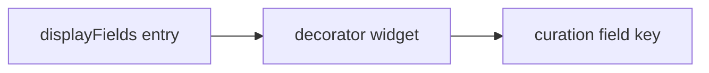

# Curation Schema Extensions

This document proposes additive schema extensions so existing read-only schemas remain valid.

## New Top-Level Keys

### `recordIdField`
String. Required for durable annotations. Field in each record that uniquely identifies the record.

Example:
```json
"recordIdField": "id"
```

If missing, the system may fall back to a deterministic hash of selected display fields (not recommended for long-term use).

### `curationFields`
Array. Defines record-level annotation fields to render in a curation panel.

Example:
```json
"curationFields": [
  { "field": "overall_rank", "label": "Overall Rank", "type": "rating", "min": 1, "max": 5 },
  { "field": "is_spam", "label": "Spam?", "type": "boolean" },
  { "field": "notes", "label": "Notes", "type": "textarea" }
]
```

### `curation`
Optional layout and UX hints.

Example:
```json
"curation": {
  "layout": "inline",
  "statusFacet": true,
  "sections": [
    { "label": "Quick Signals", "fields": ["is_spam", "overall_rank"] },
    { "label": "Qualitative", "fields": ["notes"] }
  ]
}
```

`layout` values (initial):
- `inline` (default): render the curation panel inside each record card.
- `split` (optional): left pane list + right pane curation form (Argilla-like), only when explicitly enabled.

## Diagrams

```mermaid
flowchart TB
    Schema --> RecordIdField
    Schema --> DisplayFields
    DisplayFields --> Decorators
    Schema --> CurationFields
    Schema --> Curation
    Curation --> Layout
    Curation --> Sections
    Schema --> StatusField[__curation_status (system)]
```



### Reserved System Fields

#### `__curation_status`
Computed per record and used for queueing/faceting. This is a system field and should not appear in `displayFields`.

Supported values (initial):
- `pending` (no responses)
- `draft` (partial or unsaved response)
- `submitted` (completed response)
- `discarded` (explicitly skipped)

The status field should be automatically added as a facet when curation is enabled, unless `curation.statusFacet` is explicitly set to `false`.

## Display Field Decorators (Inline Widgets)
Add a `decorators` array to `displayFields` entries to attach quick feedback to an existing display slot.

Example:
```json
"displayFields": [
  {
    "field": "title",
    "label": "Title",
    "type": "string",
    "decorators": [
      { "type": "thumbs", "field": "title_quality" },
      { "type": "rating", "field": "title_rank", "min": 1, "max": 5 }
    ]
  }
]
```

Decorators write to the same annotation storage as `curationFields`. If a decorator references a field not in `curationFields`, the UI should still render it and treat it as an implicit curation field.

## Supported Field Types (Initial)
- `boolean` (rendered as thumbs up/down or checkbox)
- `rating` (1..N stars or segmented buttons)
- `enum` (single select)
- `multienum` (multi select)
- `integer` (bounded numeric)
- `text` (single line)
- `textarea` (multi-line)

## Validation Rules (Initial)
- `enum`: value must be in `choices`.
- `multienum`: array of values must all be in `choices`.
- `integer`: enforce `min`/`max` if provided.
- `rating`: enforce `min`/`max` if provided.

## JSON Schema (Optional, for validation tooling)
A future addition can add a formal JSON Schema for the new keys. The UI can operate without it.

## Backwards Compatibility
- If `curationFields` is missing, the UI renders exactly as today.
- If `decorators` are missing, display fields render as today.
- If `recordIdField` is missing, curation is disabled by default (or relies on a deterministic hash only when explicitly enabled).
- If `curation.statusFacet` is false, the status field is still tracked but not faceted.
