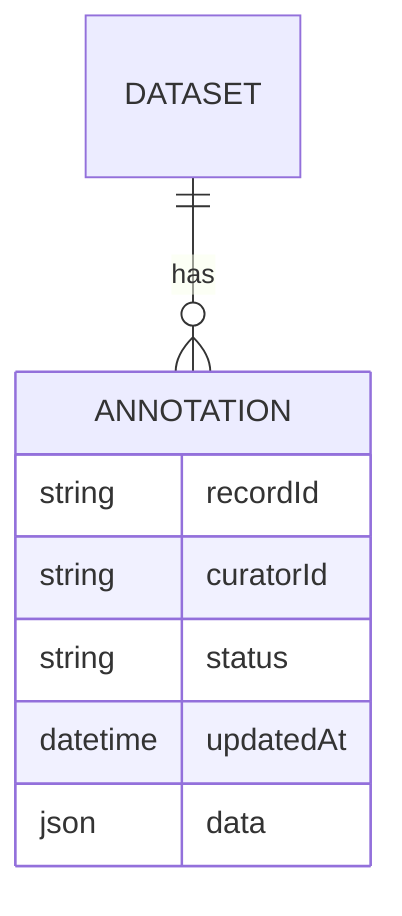
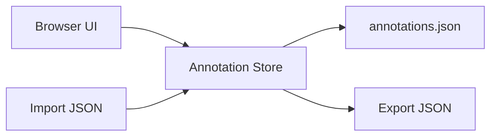

# Curation Storage + Import/Export Plan

## Annotation Data Model
Each record annotation is a small object keyed by `recordId`.

```json
{
  "recordId": "R-001",
  "curatorId": "alice",
  "updatedAt": "2026-01-28T12:10:00Z",
  "status": "submitted",
  "data": {
    "overall_rank": 4,
    "is_spam": false,
    "notes": "ambiguous case"
  }
}
```

## Diagrams





## Storage Abstraction
Implement a simple interface in the frontend:

- `loadAnnotation(recordId)`
- `saveAnnotation(recordId, data)`
- `listAnnotations()`
- `clearAnnotations()` (optional)

The store should persist `status` alongside `data`. If `status` is missing, compute it from the saved data and completeness rules.

## Curator Identity
- Read `curatorId` from a user-level config file where possible (desktop app) with environment variable overrides.
- Fall back to a user prompt if no identifier is found.

### Implementations
1) **LocalStorageStore** (MVP)
   - Suitable for small datasets.
   - Simple key: `linkml_browser_annotations::<datasetHash>`

2) **IndexedDBStore** (Phase 2)
   - Required for larger datasets.
   - Use a single object store keyed by `recordId`.

3) **ApiStore** (Phase 3)
   - CRUD endpoints for annotations.
   - Auth token stored in memory or local storage.

## Export

### JSON (preferred)
File: `annotations.json`

```json
{
  "schemaVersion": 1,
  "datasetHash": "sha256:...",
  "exportedAt": "2026-01-28T12:34:56Z",
  "annotations": [ ... ]
}
```

## Import

### Merge Policies
- **Overwrite**: replace local values for matching `recordId`.
- **Prefer newest**: compare `updatedAt`.
- **Ask**: prompt per conflict (phase 2).

### Validation
- Ensure `recordId` exists and is non-empty.
- Validate field types using schema rules.
- Report invalid rows with a summary panel (e.g., “3 skipped, 2 invalid”).

## Dataset Safety
- `datasetHash` (optional) warns if importing into a different dataset.
- If hash mismatch, show warning but allow import.

## UI Hooks
- Global toolbar buttons: Export JSON, Import.
- Record-level status: saved / unsaved / invalid.

## Optional API Contract (Phase 3)
- `POST /auth/login`
- `GET /annotations?recordId=...`
- `POST /annotations` (upsert)
- `GET /annotations?filter=...` for batch load
