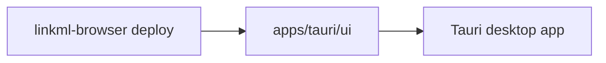
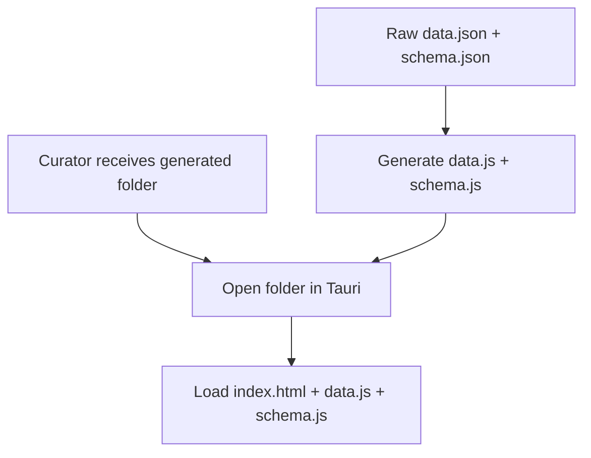

# Tauri Desktop App Plan

## Goals
- Package the existing generated static UI as a desktop app without changing the default static-site workflow.
- Provide durable local annotation storage (JSON file) and native file dialogs.
- Keep the same JS/HTML/CSS logic; add only small bridge code.
- Allow optional API sync later without making it required.

## Non-Goals (initial)
- Rewriting search/faceting in Rust.
- Multi-user collaboration or server-hosted datasets.
- Complex auth flows beyond optional API tokens.

## Repo Layout (Monorepo)
```
apps/
  tauri/
    src-tauri/
    ui/                 # generated output (same as static site output)
```

- Keep `src/linkml_browser/index.html` as the source of truth.
- The generator writes a complete static bundle into `apps/tauri/ui/`.
- Tauri points its `distDir` to `apps/tauri/ui/`.

## Diagrams

```mermaid
flowchart TB
    Root[repo root] --> Apps[apps/]
    Apps --> Tauri[tauri/]
    Tauri --> SrcTauri[src-tauri/]
    Tauri --> UI[ui/ (generated)]
    Root --> Src[src/linkml_browser/]
    Src --> Template[index.html]
```



## Build Flow

### Static (unchanged)
```
uv run linkml-browser deploy data.json out/
```

### Desktop
```
uv run linkml-browser deploy data.json apps/tauri/ui
cd apps/tauri
cargo tauri dev
```

## Dataset Workflow (Desktop)

### Recommended: Open a generated browser folder
- Curator receives a folder containing `index.html`, `data.js`, and `schema.js` (the same output as static deploy).
- Desktop app opens that folder and loads the UI directly.
- This keeps the generator as the single source of truth and avoids schema discovery inside the app.

### Alternative: Open raw data + schema
- App accepts `data.json` and `schema.json`, then generates `data.js`/`schema.js` into an app workspace directory.
- Useful for convenience, but adds complexity (duplicate generator logic or a bundled Python runtime).

### Bundled schema/data (not default)
- A dedicated desktop build could embed a specific dataset for turnkey distribution.
- Not recommended as the primary workflow; keep the app generic.

### Desktop UX (End Users)
- On launch, show a dataset chooser with:
  - “Open dataset folder…” (select a folder containing `index.html`, `data.js`, `schema.js`)
  - A “Recent datasets” list stored in app config
- If a recent dataset exists, allow one-click reopen.
- Keep the binary usable without a terminal (double‑click experience).

### Dev/Testing Workflow (Gallery Switching)
- Keep `ui/` as a staging folder for dev.
- Switch datasets quickly by copying or symlinking a gallery folder:
  - `cp -R docs/gallery/dismech/* ui/`
  - or `ln -sfn docs/gallery/dismech ui` (fastest)



## Configuration
- Tauri config uses `distDir: "../ui"` and `devPath` for local preview.
- Allowlist only the needed APIs:
  - file dialogs
  - filesystem (scoped to the app data directory)
- Disable remote navigation by default.

## Storage
- Use a local JSON file stored in the app data directory (Tauri path APIs).
- Simple load/save with atomic writes.
- Avoid database dependencies (no SQLite/MySQL).
- Store a user identifier in a small app-level config file (see User Identity).

### File Format (Proposed)
- One file per dataset to avoid collisions and simplify backup/export.
- Filename derived from dataset hash: `annotations_<datasetHash>.json`

Example:
```json
{
  "schemaVersion": 1,
  "datasetHash": "sha256:...",
  "updatedAt": "2026-01-28T12:34:56Z",
  "annotations": {
    "R-001": {
      "recordId": "R-001",
      "curatorId": "alice",
      "status": "submitted",
      "updatedAt": "2026-01-28T12:10:00Z",
      "data": {
        "overall_rank": 4,
        "is_spam": false
      }
    }
  }
}
```

## User Identity
- Read a `curatorId` from a user-level config file, e.g. `linkml-browser.json` in the app config directory.
- Allow environment variable overrides (e.g., `LINKML_BROWSER_CURATOR_ID`).
- If neither is set, prompt once and persist to the config file.

## UI Integration Strategy
- Add a small "store" abstraction in JS.
- At runtime detect `window.__TAURI__`:
  - If present, use Tauri store backend (file).
  - Else, fall back to browser localStorage.
- Keep the rendering pipeline identical for static and desktop.

## Security / Permissions
- Use Tauri allowlist to restrict file system scope.
- Disallow opening external URLs unless explicitly enabled.
- Store API tokens in OS keychain (Phase 3).

## Distribution
- Provide packaged builds for macOS/Windows/Linux.
- Use GitHub Actions for release artifacts.

## Risks / Open Questions
- Large datasets may need incremental writes or sharding to avoid memory pressure (low risk for single-user, slow manual curation).
- File storage concurrency for multiple windows (low risk for single-window usage).
- The generator must ensure stable record IDs for durable annotations.

## Milestones
1) Scaffold Tauri app and wire distDir to generated UI.
2) Implement local JSON storage via Tauri FS.
3) Packaging + release workflow.
